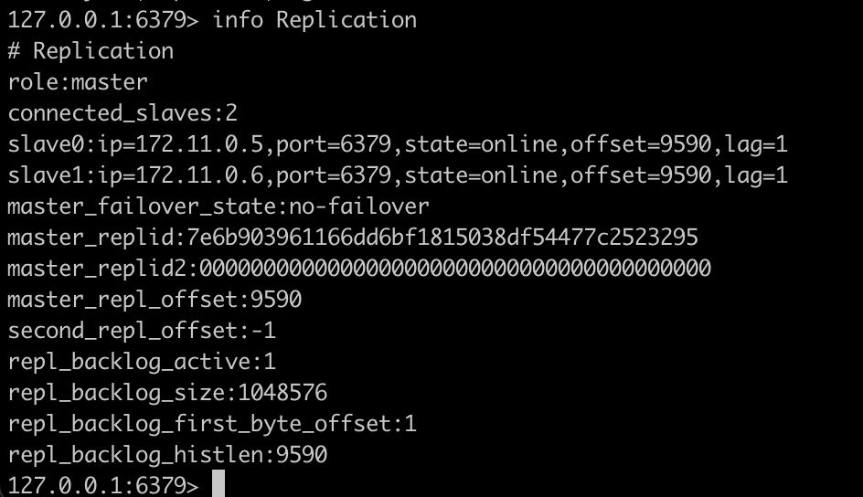
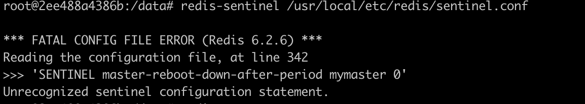

## 1 单机模式

### 1.1 不带配置文件
```
docker run --name redis -p 6379:6379 -v /<dir>/docker/redis/data:/data redis --requirepass 123456
```

### 1.2 带配置文件
```
docker run --name redis -p 6379:6379 -v /<dir>/docker/redis/data:/data -v /<dir>/docker/redis/config/redis.conf:/etc/redis/redis.conf redis redis-server /etc/redis/redis.conf
```

## 2 主从复制

### 2.1不带配置文件
#### 2.1.1 master(主库)

````
# 运行服务
docker run -it --name redis-master -d -p 6300:6379 redis redis-server --requirepass 123456
# 测试连接redis
docker exec -it redis-master redis-cli -a 123456
````

##### 2.1.2 slave(从库)
```
# 运行服务
docker run -it --name redis-slave -d -p 6301:6379 redis redis-server --requirepass 123456
# 测试连接redis
docker exec -it redis-slave redis-cli -a 123456
```

#### 2.1.3 从库配置(Docker环境下)
```
#查询docker容器所对应的真是网络ip
docker inspect <containerid>

#进入slave
docker exec -it redis-slave redis-cli -a 123456
  
slaveof <master-ip> <master-port>。<master-ip>为主库服务ip，<master-port>表示主库所在端口，默认6379 

```
#### 2.1.4 密码认证
```
config set masterauth <master-password>。<master-password>即为主库访问密码
```
#### 2.1.5 测试命令
```
#查看主从配置
输入info或info Replication
```

### 2.2 带配置文件（重启后不失效）

> docker安装后，会默认三种网络类型。(bridge,none,host),不指定的清空下，默认是bridge ，此时默认IP为172.17.0.x
> 如果想把网络固定下来，需要设置自定义网络 参见：https://zhuanlan.zhihu.com/p/377236484

### 2.2.1 master 配置
```
在conf文件中，添加

#1.<固定密码>
requirepass 123456
```

```
docker network create --subnet=172.11.0.0/20 mynetwork

#docker run -it --name redis-master -d -p 6300:6379 --ip 172.17.0.4  -v /<dir>/docker/redis/config/redis.conf:/etc/redis/redis.conf redis redis-server /etc/redis/redis.conf 

docker run -it --name redis-master -d -p 6300:6379 --net mynetwork --ip 172.11.0.4  -v /Users/panshunxing/docker/redis/config/replication/redis_master.conf:/etc/redis/redis.conf redis redis-server /etc/redis/redis.conf 

# 测试连接redis
docker exec -it redis-master redis-cli -a 123456

```


### 2.2.1 slave 配置
```
在conf文件中，添加
<固定密码>
requirepass 123456

#replicaof <masterip> <masterport>
replicaof 172.11.0.4 6379

masterauth <master-password>

```

```
docker run -it --name redis-slave -d -p 6301:6379 --ip 172.17.0.5  -v /<dir>/docker/redis/config/redis.conf:/etc/redis/redis.conf redis redis-server /etc/redis/redis.conf 

docker run -it --name redis-slave1 -d -p 6302:6379 --net mynetwork --ip 172.11.0.5  -v /Users/panshunxing/docker/redis/config/replication/redis_slave.conf:/etc/redis/redis.conf redis redis-server /etc/redis/redis.conf 

docker run -it --name redis-slave2 -d -p 6303:6379 --net mynetwork --ip 172.11.0.6  -v /Users/panshunxing/docker/redis/config/replication/redis_slave.conf:/etc/redis/redis.conf redis redis-server /etc/redis/redis.conf 


```

## 3 哨兵模式

### 3.1最小化搭建
至少需要3个Sentinel实例，且3个实例应该在独立方式发生故障的不同的物理机或者虚拟机上。
<image src="https://yqfile.alicdn.com/img_e64f47a8684956ef1de9f7c4a9ff4f07.png">


### 3.2 先搭建一主，二从 （方法如主从复制）



### 3.3 配置三个个sentinel


以下是一组 sentinel1.conf

```
# sentinel monitor <master-name> <ip> <redis-port> <quorum>
# mymaster:自定义集群名，如果需要监控多个redis集群，只需要配置多次并定义不同的<master-name> <master-redis-ip>:主库ip <master-redis-port>:主库port <quorum>:最小投票数，由于有三台redis-sentinel实例，所以可以设置成2
sentinel monitor mymaster 172.17.0.4 6379 2

# sentinel auth-pass <master-name> <password>
sentinel auth-pass mymaster 123456

# 添加后台运行
daemonize yes
```

复制出另外两份 sentinel2.conf、 sentinel3.conf

> quorum 仲裁参数，代表需要几个哨兵发现主节点下线，才能投票选出新的主节点

```
#修改 每一组哨兵的端口
port <sentinel-port>
```
sentinel1.conf、sentinel2.conf、 sentinel3.conf 监控端口分别设置为:26001,26002,26003

### 3.4 启动sentinel

> 启动sentinel有两种方式：<br>
> redis-sentinel /path/to/sentinel.conf <br>
> redis-server /path/to/sentinel.conf --sentinel


```
# redis-sentinel实例1
docker run -it --name redis-sentinel1 --net mynetwork --ip 172.11.0.7 -v /Users/panshunxing/docker/redis/config/sentinel/sentinel1.conf:/usr/local/etc/redis/sentinel.conf -d redis /bin/bash
    
# redis-sentinel实例2
docker run -it --name redis-sentinel2 --net mynetwork --ip 172.11.0.8 -v /Users/panshunxing/docker/redis/config/sentinel/sentinel2.conf:/usr/local/etc/redis/sentinel.conf -d redis /bin/bash
    
# redis-sentinel实例3
docker run -it --name redis-sentinel3 --net mynetwork --ip 172.11.0.9 -v /Users/panshunxing/docker/redis/config/sentinel/sentinel3.conf:/usr/local/etc/redis/sentinel.conf -d redis /bin/bash

# 进入sentinel
docker exec -it redis-sentinel(x) bash

docker exec -it redis-sentinel1 bash
docker exec -it redis-sentinel2 bash
docker exec -it redis-sentinel3 bash

# 启动redis-sentinel
redis-sentinel /usr/local/etc/redis/sentinel.conf
```
#### 3.4.1 FAQ

> redis-sentinel /usr/local/etc/redis/sentinel.conf 报错

> 解决：sentinel.conf 版本跟当前的版本不一致，使用redis-server -v 命令找到当前在用的redis版本，再下载匹配当前版本的conf

### 3.5 测试

```
连接并使用redis-sentinel API查看监控状况:
redis-cli -p 26001 (26002 | 26003)
sentinel master mymaster 或 sentinel slaves mymaster
```

1.进入redis-master容器，休眠60秒redis服务：

```
docker exec -it redis-master bash
redis-cli -a <redispassword> -p <port> DEBUG sleep 60

redis-cli -a 123456 -p 6379 DEBUG sleep 60

```

2.进入redis-slave或redis-slave2容器，查看info Replication，可以看到master已经完成了切换。
