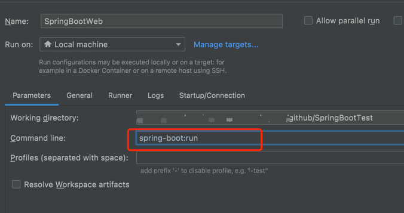
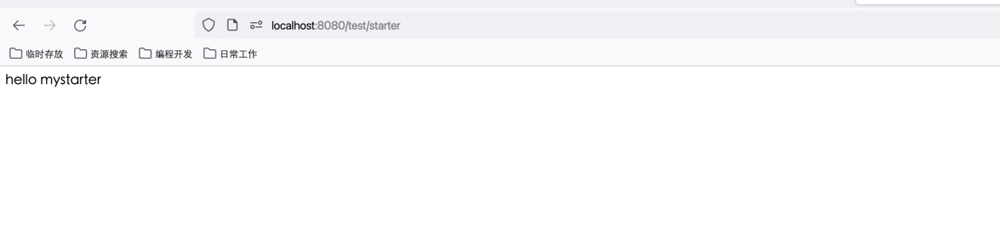

## Spring 中常用的模式

### 监听者模式 ： ApplicationListener

### 单例模式 ：

## 快速搭建Web应用

### 添加依赖


```
		<dependency>
			<groupId>org.springframework.boot</groupId>
			<artifactId>spring-boot-starter-web</artifactId>
		</dependency>
```

### 新建一个control

```
@RestController
public class DemoStarterController {
    @Resource
    private DemoService demoService;

    @GetMapping("/test/starter")
    public String sayWhat(){
        return demoService.say();
    }
}
```

### 运行

1.配置


2.访问 http://localhost:8080/test/starter



### web容器配置定义

Spring-boot-starter-web 默认使用的是tomcat,比如需要修改tomcat端口号，只需要在 application.properties 增加以下内容
````
# Tomcat配置
server.port=8082
````

## 数据访问

### 添加依赖

```
		<dependency>
			<groupId>org.springframework.boot</groupId>
			<artifactId>spring-boot-starter-jdbc</artifactId>
			<scope>test</scope>
		</dependency>

```

### 配置datasource

在application.properties 增加以下内容
````
# 数据库配置
spring.datasource.url=jdbc:mysql://127.0.0.1:3306/springtest
spring.datasource.username=root
spring.datasource.password=123456
````

#TODO


## Aop使用

### 添加依赖

```
		<dependency>
			<groupId>org.springframework.boot</groupId>
			<artifactId>spring-boot-starter-aop</artifactId>
		</dependency>
```

### 结合 metrics 解决应用性能数据采集

#### 添加依赖

```
		<dependency>
			<groupId>org.springframework.boot</groupId>
			<artifactId>spring-boot-starter-actuator</artifactId>
		</dependency>
		<dependency>
			<groupId>io.dropwizard.metrics</groupId>
			<artifactId>metrics-core</artifactId>
			<version>${metrics.version}</version>
		</dependency>
		<dependency>
			<groupId>io.dropwizard.metrics</groupId>
			<artifactId>metrics-annotation</artifactId>
			<version>${metrics.version}</version>
		</dependency>
```

### 添加配置类

```
@Configuration
@ComponentScan({"com.keevol.springboot.metrics.lifecycle", "com.keevol.springboot.metrics.aop"})
@AutoConfigureAfter(AopAutoConfiguration.class)
public class DropwizardMetricsMBeansAutoConfiguration {
    @Value("${metrics.mbeans.domain.name:com.keevol.metrics}")
    String metricsMBeansDomainName;
    @Autowired
    MBeanServer mbeanServer;
    @Autowired
    MetricRegistry metricRegistry;
    @Bean
    public JmxReporter jmxReporter() {
        JmxReporter reporter = JmxReporter
                .forRegistry(metricRegistry)
                .inDomain(metricsMBeansDomainName)
                .registerWith(mbeanServer)
                .build();
        return reporter;
    }

}
```

并把配置类增加到META-INF/spring.factories里

```
org.springframework.boot.autoconfigure.EnableAutoConfiguration=com.example.springboottest.DropwizardMetricsMBeansAutoConfiguration
```