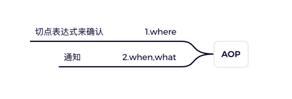

### 简单描述AOP





### FAQ

问：出现启动后无法访问 control
答：检查启动类中有无指定扫描的包

>原因：application 在启动加载时，只扫描所在包及其子包下的文件。当类在其他位置时，是扫描不到的，导致无法收到请求。
```
// 扫描包
@SpringBootApplication(scanBasePackages = "cn.xxxxx.com.xxxxx")
```


## 实践

https://zhuanlan.zhihu.com/p/141344645