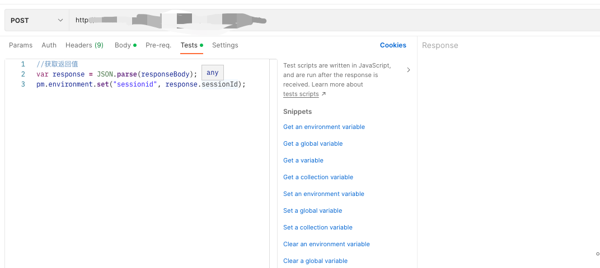
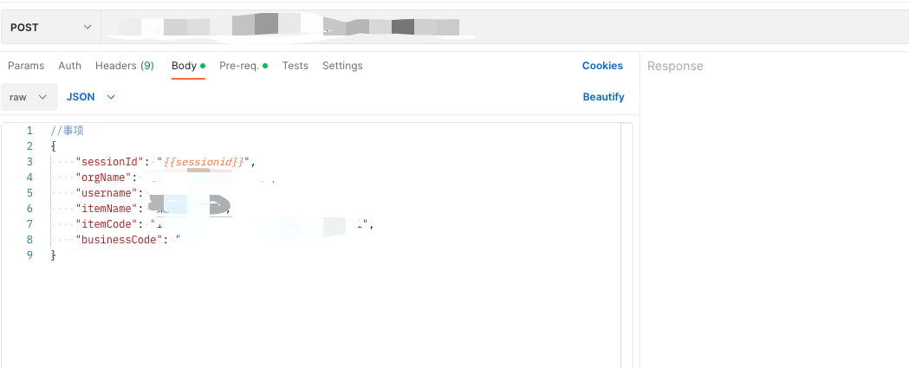

## 使用场景
- 登陆后，保留登陆session供后面一个接口使用

## 步骤

### 前置接口保存信息
```
//获取返回值
var response = JSON.parse(responseBody);
pm.environment.set("sessionid", response.sessionId);

```

### 后置接口使用信息

```
//事项
{
    "sessionId": "{{sessionid}}"
}
```

## 示例


