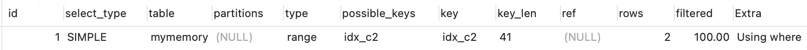

```
-- 创建基于Memory引擎的表
CREATE TABLE mymemory (
id INT,
c1 VARCHAR ( 10 ),
c2 CHAR ( 10 )
) ENGINE = memory;

-- Memory引擎，默认索引类型是hash
create index idx_c1 on mymemory(c1);

-- 创建Btree类型索引
create index idx_c2 using btree on mymemory(c2);

-- 查看当前的索引类型
show index from mymemory;

-- 插入测试数据
INSERT into mymemory(id,c1,c2) values(1,SUBSTR(UUID(),1,10),SUBSTR(UUID(),1,10));
INSERT into mymemory(id,c1,c2) values(2,SUBSTR(UUID(),1,10),SUBSTR(UUID(),1,10));
INSERT into mymemory(id,c1,c2) values(3,SUBSTR(UUID(),1,10),SUBSTR(UUID(),1,10));
INSERT into mymemory(id,c1,c2) values(4,SUBSTR(UUID(),1,10),SUBSTR(UUID(),1,10));
INSERT into mymemory(id,c1,c2) values(5,SUBSTR(UUID(),1,10),SUBSTR(UUID(),1,10));
INSERT into mymemory(id,c1,c2) values(6,SUBSTR(UUID(),1,10),SUBSTR(UUID(),1,10));
INSERT into mymemory(id,c1,c2) values(7,SUBSTR(UUID(),1,10),SUBSTR(UUID(),1,10));
INSERT into mymemory(id,c1,c2) values(8,SUBSTR(UUID(),1,10),SUBSTR(UUID(),1,10));
INSERT into mymemory(id,c1,c2) values(9,SUBSTR(UUID(),1,10),SUBSTR(UUID(),1,10));

-- Hash值没有顺序：不能范围查询以及排序操作；
EXPLAIN SELECT * from mymemory where c1>'a' and c1<'d';


EXPLAIN SELECT * from mymemory where c2>'a' and c2<'d';


-- 都未走索引
EXPLAIN SELECT * from mymemory ORDER BY c1;
EXPLAIN SELECT * from mymemory ORDER BY c2;

-- TODO Hash不能使用最左前缀原则进行优化；
-- TODO Hash冲突导致性能底下。
```
